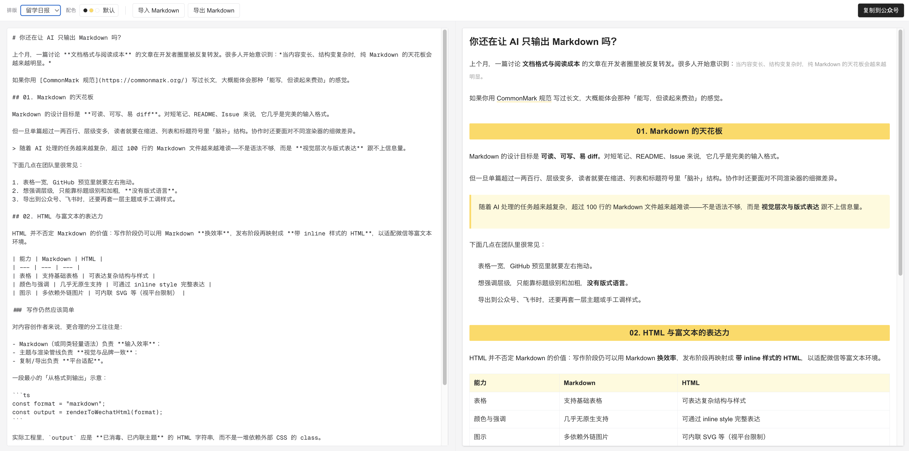
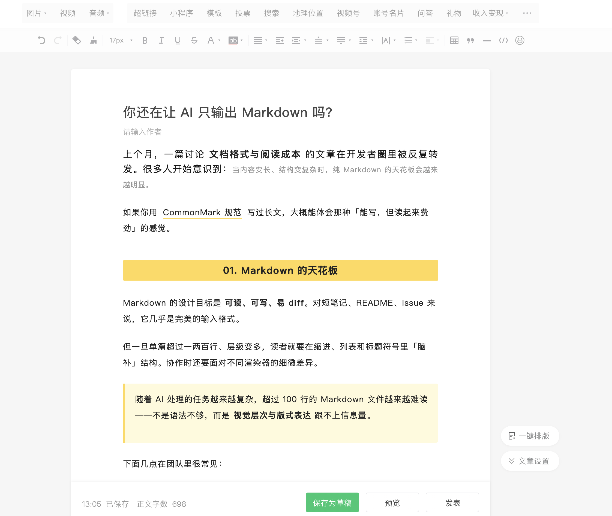
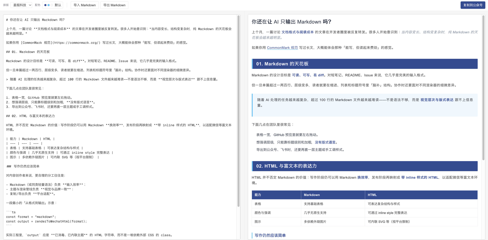
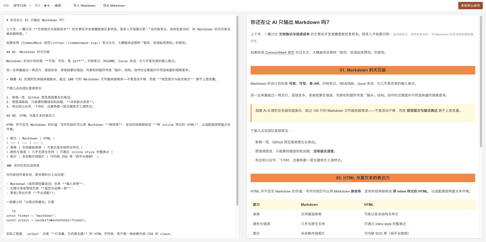

# md2wechat

**English** | [中文](README.zh-CN.md)

**md2wechat** is a local-first Markdown formatter for WeChat Official Account articles.

Write in plain Markdown, preview a WeChat-friendly white-background article layout, then copy rich text with **inline styles** directly into the WeChat Official Account editor.

> Plain Markdown → sanitized HTML → inline styles → paste into WeChat

md2wechat is not a CMS or collaboration platform. By default, it has no backend, no login, and no database. Drafts and UI choices stay in your browser local storage.

## Screenshots

### Editor preview



### Paste result in WeChat Official Account editor



### Theme examples





## Why

The WeChat Official Account editor is good for publishing, but not great for writing and formatting long structured content.

Common pain points:

- Long-form writing and restructuring are awkward in the editor.
- Markdown content usually needs to be manually restyled before publishing.
- CSS classes, Tailwind classes, or external styles often disappear after pasting.
- A web preview may look nice, but the result can break in WeChat's white-background editing environment.

md2wechat keeps Markdown as the writing format, then maps it into WeChat-friendly rich text with inline styles.

## Features

- Markdown editing with live preview
- GFM support, including tables and task lists
- Copy rich text to the WeChat Official Account editor
- Import / export `.md` files
- Autosave draft, layout theme, and palette in browser `localStorage`
- Multiple article layout themes
- Multiple color palettes
- White-background-first preview designed for WeChat readability

## Quick Start

Requirements:

- Node.js 20+
- npm
- A modern browser, preferably Chrome or Edge

```bash
git clone https://github.com/XiaotianTang3/md2wechat_official_accounts.git
cd md2wechat_official_accounts
npm install
npm run dev
```

Open:

```txt
http://localhost:3000
```

Production build:

```bash
npm run build
npm run start
```

Lint:

```bash
npm run lint
```

## Usage

1. Write Markdown on the left, or import a `.md` file.
2. Choose a layout theme from the toolbar.
3. Choose a color palette, or keep `Default`.
4. Check the WeChat-style article preview on the right.
5. Click `Copy to WeChat`.
6. Paste into the WeChat Official Account editor.
7. Use WeChat's own preview before publishing.

## Layout Themes

The `Layout` control changes the article structure and typography.

Built-in themes:

- **Minimal Longform**: restrained, body-first, suitable for essays, notes, and methodology posts.
- **Starship Tech**: stronger headings and highlights, suitable for AI, tech, and product analysis.
- **Study Daily**: yellow section highlights, suitable for education, study-abroad, career, and commentary posts.
- **Xinhua-inspired**: blue section headings with red emphasis, suitable for news-like or formal information posts.

Themes control structural styling such as font size, line height, headings, blockquotes, tables, and code blocks.

## Color Palettes

The `Palette` control changes local accent colors for headings, emphasis, blockquotes, tables, and code blocks.

Built-in palettes:

- **Default**: use the current layout theme's native colors
- **Ink Gray**: formal and restrained
- **Starry Blue**: tech, AI, and product analysis
- **Turquoise Green**: tutorials and knowledge notes
- **Film Brown**: personal essays, stories, and retrospectives
- **Purple Mist**: light tech and futuristic content
- **Warm Orange**: methodology, experience sharing, and lightweight knowledge posts

`Default` is not a global fixed palette. It means “use the native colors of the current layout theme.” Choosing another palette overrides the theme colors.

## Supported Markdown

md2wechat uses unified / remark / rehype to render Markdown and supports common GFM content:

- Headings: `#` / `##` / `###`
- Paragraphs and line breaks
- Bold, italic, links, inline code
- Blockquotes
- Ordered and unordered lists
- Task lists
- Tables
- Code blocks
- Horizontal rules
- Images

A manual validation sample is included at:

```txt
docs/validation-markdown-sample.md
```

Use it to test previews, WeChat paste fidelity, and mobile preview behavior across different themes and palettes.

## Copying to WeChat

`Copy to WeChat` copies inline-styled HTML with a plain-text fallback.

Design principles:

- Do not depend on external CSS.
- Do not copy Tailwind classes into article content.
- Do not force a full-page background color.
- Prioritize readability in WeChat's default white editor environment.
- Preserve local styles for tables, blockquotes, and code blocks as much as possible.

Different browsers and WeChat editor versions may handle rich-text paste differently. Always verify the final result in WeChat before publishing.

## Image Handling

md2wechat renders Markdown images. Remote images may paste into WeChat in some cases, for example:

```md

```

Images are not a core guarantee in the current version:

- Whether remote images survive paste depends on how WeChat handles external images.
- Local image paths such as `./assets/demo.png` or `/Users/.../demo.png` usually cannot be used directly by WeChat.
- For production publishing, the safer workflow is to upload images in the WeChat editor and adjust their positions there.

md2wechat currently focuses on text layout: body copy, headings, blockquotes, tables, and code blocks.

## Privacy

By default, md2wechat only stores local browser state in `localStorage`:

- Draft content
- Current layout theme
- Current color palette

There is no account system and no server-side upload of your article content. Copying to WeChat happens between your browser and the WeChat editor.

## How It Works

Simplified pipeline:

1. Markdown is converted into semantic HTML with unified / remark / rehype.
2. `rehype-sanitize` sanitizes the HTML.
3. The selected layout theme and color palette are converted into inline styles.
4. The preview renders the same inline-styled HTML.
5. The copy action writes `text/html` and `text/plain` to the clipboard.

Tailwind CSS is only used for the app shell. It is not copied into the WeChat article HTML.

## Limitations

Intentionally out of scope:

- Custom Markdown DSL
- Free-form color picker / HEX input
- Element-level CSS editing
- Theme marketplace
- Image upload / CDN / WeChat material library management
- Backend sync
- Login and permissions
- Complex template system
- Mobile phone mockup preview

Known limitations:

- The WeChat editor may sanitize or rewrite some styles.
- Rich-text clipboard behavior can differ across browsers.
- Tables, code blocks, and remote images should be manually checked in WeChat.
- Local images should be uploaded in the WeChat editor.

## Development

Tech stack:

- Next.js App Router
- React
- TypeScript
- Tailwind CSS for app shell UI only
- unified / remark / rehype for Markdown to HTML
- rehype-sanitize for HTML sanitization

Common commands:

```bash
npm run dev
npm run lint
npm run build
```

Layout themes:

```txt
lib/themes.ts
```

Color palettes:

```txt
lib/palettes.ts
```

Markdown rendering and clipboard pipeline:

```txt
lib/markdown.ts
lib/inlineStyles.ts
lib/clipboard.ts
```

## Deployment

Deploy to Vercel or any platform that supports Next.js.

For personal use, running locally is enough. Even when deployed, md2wechat remains a frontend tool by default, with no backend, login, or cloud sync.

## License

MIT
